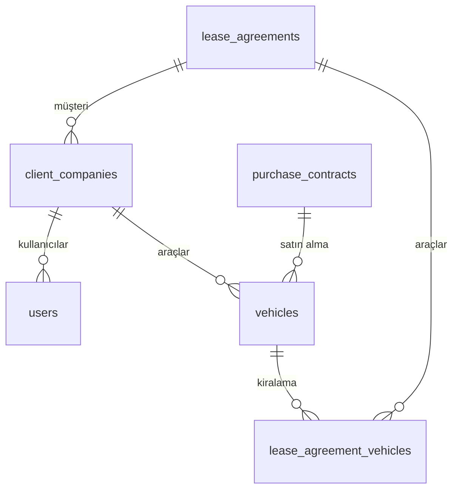

# Veritabanı Şeması ve ER Diyagramı

Bu doküman, ana tabloları ve ilişkileri özetler.

## ER Diyagramı (Mermaid)

```

## Tablolar
- **client_companies:** id, company_name, contact_person, email, phone, address, created_at
- **users:** id, username, password, role, client_company_id, created_at
- **vehicles:** id, plate_number, brand, model, ...
- **purchase_contracts:** id, contract_number, supplier, ...
- **lease_agreements:** id, client_company_id, contract_number, ...
- **lease_agreement_vehicles:** id, lease_agreement_id, vehicle_id
- **reports:** id, name, data, created_at

## Notlar
- Tüm ilişkiler foreign key ile tanımlı.
- Detaylı şema için schema.sql dosyasına bakınız.
