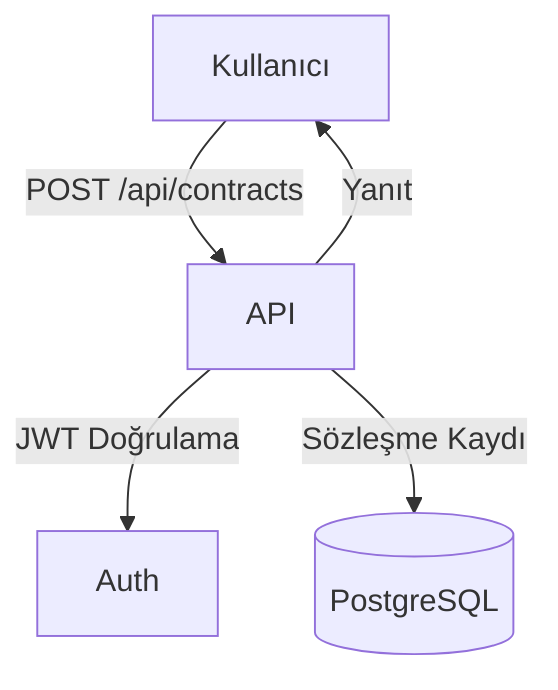

# Sözleşme Modülü (Contracts)

Bu doküman, araç kiralama ve satın alma sözleşmeleri yönetimi modülünün işlevlerini ve akış diyagramını içerir.

## Modül Özeti
- Satın alma ve kiralama sözleşmeleri oluşturma, güncelleme, silme, listeleme
- Sözleşme ile araç ve müşteri ilişkilendirme

## Akış Diyagramı (Mermaid)

## Temel Endpoint'ler
- `POST /api/contracts` : Yeni sözleşme ekler
- `GET /api/contracts` : Sözleşmeleri listeler
- `PUT /api/contracts/:id` : Sözleşme günceller
- `DELETE /api/contracts/:id` : Sözleşme siler

## Notlar
- Sözleşmelerde müşteri ve araç ilişkisi zorunludur.
- Tüm işlemler JWT ile korunur.
