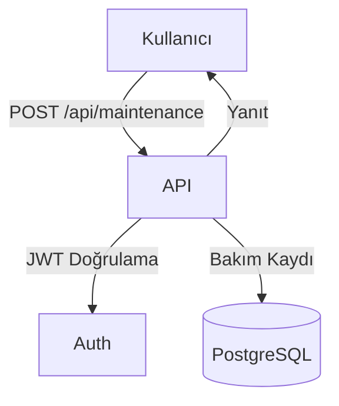

# Bakım Modülü (Maintenance)

Bu doküman, araç bakım yönetimi modülünün işlevlerini ve akış diyagramını içerir.

## Modül Özeti
- Araçlara bakım kaydı ekleme, güncelleme, silme, listeleme
- Bakım türü, maliyet, tarih ve açıklama takibi

## Akış Diyagramı (Mermaid)

## Temel Endpoint'ler
- `POST /api/maintenance` : Yeni bakım kaydı ekler
- `GET /api/maintenance` : Bakım kayıtlarını listeler
- `PUT /api/maintenance/:id` : Bakım kaydı günceller
- `DELETE /api/maintenance/:id` : Bakım kaydı siler

## Notlar
- Bakım işlemleri sadece yetkili kullanıcılar tarafından yapılabilir.
- Tüm işlemler JWT ile korunur.
