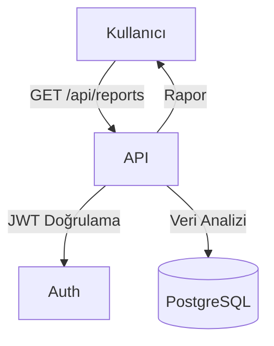

# Raporlama Modülü (Reports)

Bu doküman, raporlama ve dashboard modülünün işlevlerini ve akış diyagramını içerir.

## Modül Özeti
- Rapor oluşturma, veri analizi, dashboard verileri
- Araç, müşteri, sözleşme, bakım gibi ana veriler üzerinden özet ve detaylı raporlar

## Akış Diyagramı (Mermaid)

## Temel Endpoint'ler
- `GET /api/reports` : Raporları listeler
- `POST /api/reports` : Yeni rapor oluşturur
- `GET /api/reports/:id` : Rapor detayını getirir

## Notlar
- Raporlar sadece yetkili kullanıcılar tarafından görüntülenebilir.
- Tüm işlemler JWT ile korunur.
