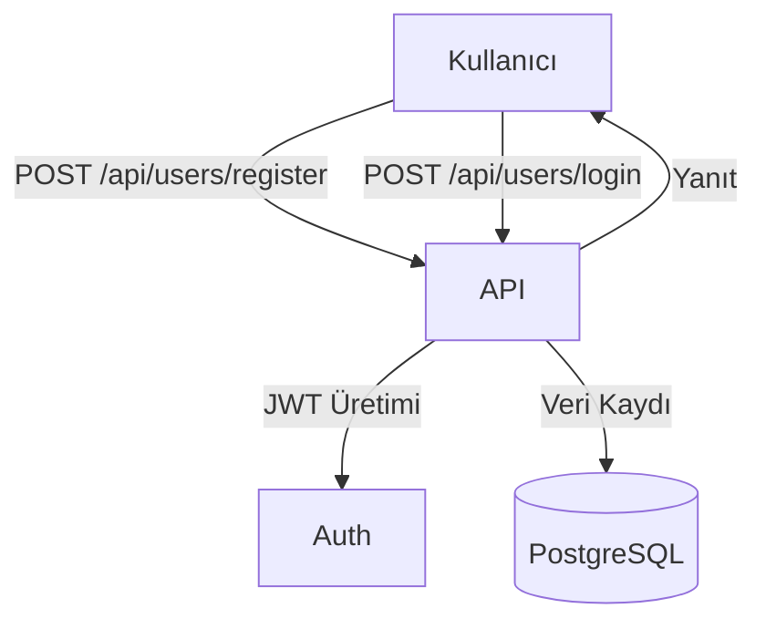

# Kullanıcı Modülü (Users)

Bu doküman, kullanıcı yönetimi modülünün işlevlerini ve akış diyagramını içerir.

## Modül Özeti
- Kullanıcı kaydı, giriş, çıkış, kullanıcı listesi
- Rol bazlı erişim kontrolü (admin/user)

## Akış Diyagramı (Mermaid)

## Temel Endpoint'ler
- `POST /api/users/register` : Yeni kullanıcı kaydı
- `POST /api/users/login` : Giriş
- `POST /api/users/logout` : Çıkış
- `GET /api/users` : Kullanıcı listesi (sadece admin)

## Notlar
- Parolalar bcrypt ile hash’lenir.
- JWT ile kimlik doğrulama zorunludur.
