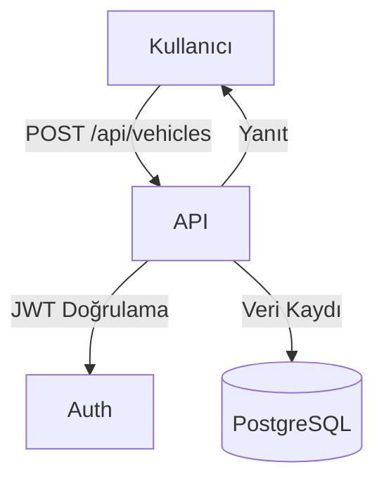

# Araç Modülü (Vehicles)

Bu doküman, araç yönetimi modülünün işlevlerini ve akış diyagramını içerir.

## Modül Özeti
- Araç ekleme, güncelleme, silme, listeleme
- Araçların kiralama, bakım, elden çıkarma süreçlerine entegrasyonu

## Akış Diyagramı (Mermaid)

## Temel Endpoint'ler
- `POST /api/vehicles` : Yeni araç ekler
- `GET /api/vehicles` : Araçları listeler
- `PUT /api/vehicles/:id` : Araç günceller
- `DELETE /api/vehicles/:id` : Araç siler

## Notlar
- Tüm işlemler JWT ile korunur.
- Sadece admin rolü araç ekleyebilir/silebilir.
